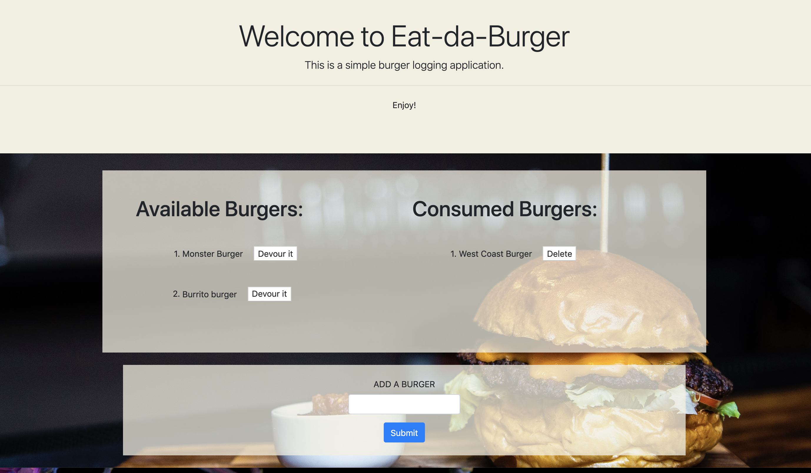

# BurgerLogger

A web application to log burger information into a database. 

## Installation

Clone folder onto your own computer by forking the repository and using the "Clone or download" button on github.

Install all npm modules using the command "npm install".

Create your mySQL database in your mySQL workbench using the schema.sql file in the root folder. 

You can pre-seed the database in your mySQL workbench using the seed.sql file in the root folder.

****Update your connection information in the connection.js file located in the config folder.

Run the server by calling node server.js from the commandline open in the root folder to run the application.

## Functionality

### Displaying Burgers
On page load, the app makes a get call to the server. The server returns all saved burgers from its database to be displayed on the page. 

### Adding New Burgers
Users can add additional burger entries to the database by navigating to the ADD A BURGER section at the bottom of the page, typing in the name of the burger, and clicking the submit button. The post request will store data in the database and the new burger will appear in the column to the left, entitled "Available Burgers".

### Devoring a Burger
Users can move the burger from the left to the right of the page by clicking on the "Devour it" button next to the burger name. Upon clicking the button, the post request will update the burger's eaten status in the database and move the burger to the "Consumed Burgers" column. 

### Deleting A Burger
Users can remove burgers from both the database and the "Consumed Burgers" column by clicking the delete button next to the desired burger. The click will send a delete request to the server. 

## Coding

This project utilizes javascript, node, mySQL, the MVC framework, and various node packages: 

1.   Express is used to stand up the server. 
  
2.   Express-handlebars is used to create the different views served to the browser. 

3.   The burgerController.js file found in the controllers folder serves as a router for all the api calls. It utlizes the burger.js module (located in the models folder) to render the webpage. 

4.   The burger model, burger.js, calls the orm to interact with the mySQL database. 

5.  Mysql-promisify is used to set up a connection to and manage the database. 

## Meta 

Jamie Kook - kookjc6@gmail.com

Github Repo: 
[https://github.com/JamieKook/BurgerLogger](https://github.com/JamieKook/BurgerLogger)

Deployed App: 
